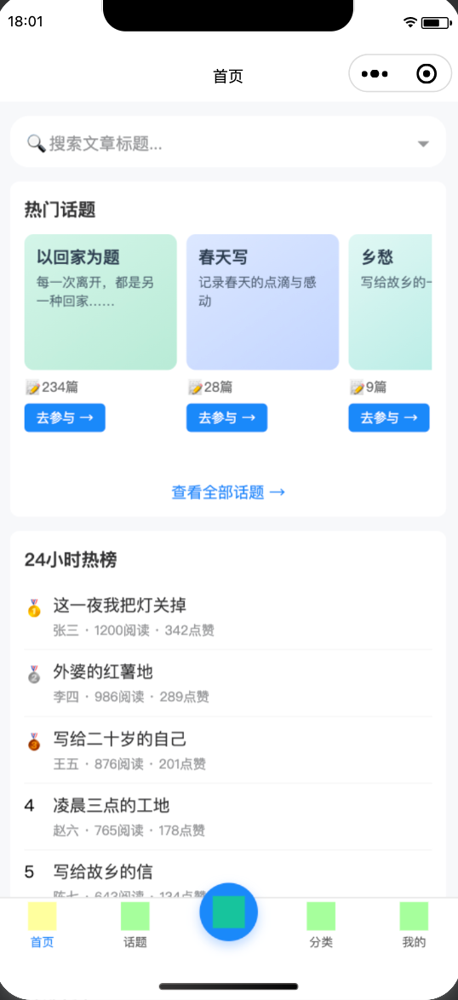
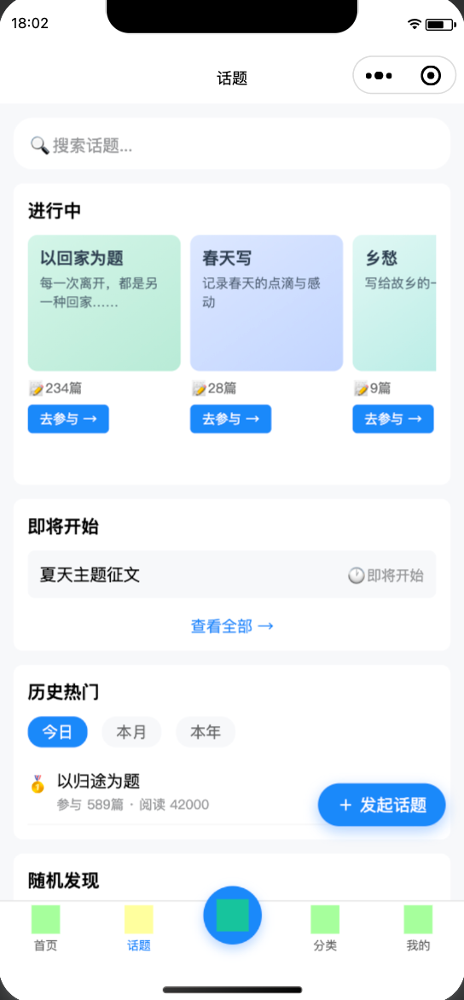

# Ice 项目启动指南

<p align="center">
  
  &nbsp;&nbsp;
  
</p>

## 项目结构

```
ice/
├── docs/          # 产品需求、线框、数据表设计（入口：docs/09-todo-项目总进度-2026-07-07.md）
├── miniprogram/   # 微信小程序前端
├── admin/         # 管理后台 Web（Vue 3 + Element Plus）
├── server/        # Java 主后端（业务编排、REST API）
├── ai/            # Python AI 后端（FastAPI，内网大模型能力）
└── openapi/       # 前后端接口契约（自动生成，仅 server）
```

**调用关系**：小程序 / 管理后台 → `server/`（REST API）→ `ai/`（内网 HTTP，不对小程序暴露）

---

## 前提条件

| 工具 | 用途 | 建议版本 |
|---|---|---|
| Docker Desktop | MySQL、Redis、AI 容器 | 已安装且正在运行 |
| JDK | 运行 `server/` | 21 |
| 微信开发者工具 | 运行小程序 | 最新稳定版 |
| Node.js | `admin/`、`miniprogram/` npm | 18+ |

确认 Docker 可用：

```bash
docker info
```

---

## 一、启动（按顺序执行）

> 每条命令在**新终端窗口**执行；`bootRun`、`npm run dev` 会占用当前终端，不要关闭。

### 步骤 1：启动 Docker（MySQL + Redis + AI）

```bash
cd server
docker compose up -d
```

查看容器是否都在运行：

```bash
docker compose ps
```

期望看到 3 个容器均为 `running`：

| 容器名 | 端口 | 说明 |
|---|---|---|
| `ice-mysql` | 3306 | 数据库，库名 `ice`，用户 `ice` / 密码 `password` |
| `ice-redis` | 6379 | 缓存 |
| `ice-ai` | 8000 | AI 审核服务 |

验证 AI 健康检查：

```bash
curl -s http://localhost:8000/health
```

> **说明**：`docker compose up -d` 会一并启动 AI。若你想**本地调试 AI 代码**（见步骤 3 备选），先只启 MySQL + Redis：
>
> ```bash
> docker compose up -d mysql redis
> ```

首次执行会拉镜像 / 构建 AI 镜像，耗时取决于网速。

---

### 步骤 2：启动后端 Server

**新开一个终端：**

```bash
cd server
./gradlew bootRun
```

看到 `Tomcat started on port 8080` 即成功。

| 地址 | 说明 |
|---|---|
| http://localhost:8080/swagger-ui.html | API 文档 |
| http://localhost:8080/v3/api-docs | OpenAPI JSON |

**备选：IntelliJ IDEA** — 打开 `server/`，运行 `com.ice.IceApplication`。

> Server 启动时会自动执行 Flyway 迁移建表，并创建种子管理员（`login_name=admin`，密码见环境变量 `ADMIN_SEED_PASSWORD`，默认 `admin123`）。

---

### 步骤 3：启动 AI 服务

#### 方式 A（推荐）：使用 Docker 中的 AI

步骤 1 已启动 `ice-ai`，**无需额外操作**。跳到步骤 4。

#### 方式 B：本地运行 AI（改代码时用）

先确保 8000 端口没有被 Docker 占用：

```bash
docker compose stop ai
```

然后：

```bash
cd ai
cp .env.example .env    # 首次需要
pip install -r requirements.txt
PYTHONPATH=. uvicorn app.main:app --reload --port 8000
```

验证：

```bash
curl -s http://localhost:8000/health
```

详见 [`ai/README.md`](ai/README.md)。

---

### 步骤 4：启动管理后台 Admin

**新开一个终端：**

```bash
cd admin
npm install          # 首次需要
npm run dev
```

浏览器打开：**http://localhost:5173**

| 登录方式 | 账号 | 密码 |
|---|---|---|
| 用户名密码 | `admin` | `admin123` |
| 开发一键登录 | 页面底部按钮（仅 DEV 环境显示） | — |

> Admin 通过 Vite 代理将 `/api` 转发到 `http://localhost:8080`，需确保步骤 2 的 Server 已启动。

---

### 步骤 5：启动微信小程序

#### 5.1 安装 npm 依赖并构建 Vant 组件

**首次打开或更新 `@vant/weapp` 后执行：**

```bash
cd miniprogram
npm install
```

然后在**微信开发者工具**菜单：**工具 → 构建 npm**。

构建成功后会生成 `miniprogram/miniprogram_npm/` 目录。若工具未生成，可手动执行：

```bash
cd miniprogram
rm -rf miniprogram_npm
mkdir -p miniprogram_npm/@vant
cp -R node_modules/@vant/weapp/lib miniprogram_npm/@vant/weapp
```

#### 5.2 用微信开发者工具打开项目

| 项 | 值 |
|---|---|
| **打开目录** | `ice/` **根目录**（不是 `miniprogram/`） |
| AppID | 使用 `project.config.json` 中的配置，或选「测试号」 |

#### 5.3 开发者工具设置

**详情 → 本地设置**，勾选：

- 不校验合法域名、web-view（业务域名）、TLS 版本以及 HTTPS 证书

#### 5.4 编译运行

点击工具栏 **编译**，然后 **预览** 或 **真机调试**。

小程序默认请求 `http://localhost:8080`（见 `miniprogram/api/api-config.ts`）。

---

### 启动完成检查清单

| 服务 | 检查方式 | 期望结果 |
|---|---|---|
| MySQL | `docker compose ps` | `ice-mysql` running |
| Redis | `docker compose ps` | `ice-redis` running |
| AI | `curl http://localhost:8000/health` | 返回正常 |
| Server | 浏览器打开 swagger-ui | 页面可访问 |
| Admin | http://localhost:5173 | 可登录 |
| 小程序 | 开发者工具模拟器 | 无红色报错，Tab 可切换 |

---

## 二、关闭（按顺序执行）

与启动顺序相反，避免端口占用和数据连接异常。

### 1. 关闭微信小程序

在微信开发者工具中关闭项目窗口即可（无命令）。

### 2. 关闭管理后台 Admin

在运行 `npm run dev` 的终端按 **`Ctrl + C`**。

### 3. 关闭后端 Server

在运行 `./gradlew bootRun` 的终端按 **`Ctrl + C`**。

若终端已关闭但 8080 仍被占用：

```bash
lsof -nP -iTCP:8080 -sTCP:LISTEN
kill <PID>           # 将 <PID> 替换为上一步看到的进程号
# 仍无法释放时：
kill -9 <PID>
```

### 4. 关闭本地 AI（仅方式 B 启动过才需要）

在运行 `uvicorn` 的终端按 **`Ctrl + C`**。

若 8000 仍被占用：

```bash
lsof -nP -iTCP:8000 -sTCP:LISTEN
kill <PID>
```

### 5. 关闭 Docker 容器

```bash
cd server
docker compose down
```

| 命令 | 效果 |
|---|---|
| `docker compose down` | 停止并删除容器，**数据保留**（推荐日常使用） |
| `docker compose down -v` | 同时删除数据卷，**数据库清空**，慎用 |

确认已全部停止：

```bash
docker compose ps
# 应无 running 容器
```

---

## 三、常见问题与解决

### 1. Server 启动失败：`Port 8080 was already in use`

8080 已被占用（通常是上次 Server 未关干净）。

```bash
# 查看占用进程
lsof -nP -iTCP:8080 -sTCP:LISTEN

# 结束进程（替换 PID）
kill <PID>

# 然后重新启动
cd server && ./gradlew bootRun
```

或换端口启动（需同步改小程序 `API_BASE_URL` 和 admin 代理配置）：

```bash
SERVER_PORT=8081 ./gradlew bootRun
```

---

### 2. 小程序报错：找不到 `van-button` 等 Vant 组件

原因：`miniprogram_npm` 未构建。

```bash
cd miniprogram && npm install
```

微信开发者工具：**工具 → 构建 npm** → 点击 **编译**。

仍失败时手动生成（见步骤 5.1 中的 `cp` 命令），然后重新编译。

---

### 3. 小程序请求失败 / 登录失败

1. 确认 Server 已启动：`curl -s -o /dev/null -w '%{http_code}' http://localhost:8080/v3/api-docs` 应返回 `200`
2. 开发者工具勾选 **不校验合法域名**
3. 确认打开的是 **`ice/` 根目录**，不是 `miniprogram/`

---

### 4. Docker 容器启动失败

```bash
cd server
docker compose ps        # 查看状态
docker compose logs mysql   # 查看 MySQL 日志
docker compose logs ai      # 查看 AI 日志
```

端口 3306 / 6379 / 8000 被本机其他程序占用时，需先释放或修改 `docker-compose.yml` 端口映射。

---

### 5. Admin 登录 401 / 403

| 现象 | 原因 | 处理 |
|---|---|---|
| 401 用户名或密码错误 | 密码不对 | 默认 `admin` / `admin123` |
| 403 非管理员账号 | 账号 role 不对 | 确认 V10 迁移已执行，种子超管 `role=0` |
| 网络错误 | Server 未启动 | 先完成步骤 2 |

开发环境可用登录页 **「开发环境一键登录」**（调用 `dev/login`）。

---

### 6. AI 审核不生效

1. 确认 AI 在运行：`curl http://localhost:8000/health`
2. 确认 Server 配置 `ice.ai.base-url=http://localhost:8000`（`application.yml` 默认值）
3. Mock 测试：文章正文包含 `__reject__` 触发拒绝，`__manual__` 触发人工审核

---

### 7. Gradle 首次启动很慢

首次 `./gradlew bootRun` 会下载 Gradle 和依赖，属正常现象。可加 `--no-daemon` 避免后台守护进程：

```bash
./gradlew bootRun --no-daemon
```

---

## 四、P0 演示链路（联调验收）

全部启动后，按此路径走通核心流程：

1. 小程序冷启动 → 自动微信登录（开发期用 `dev:openid`）
2. **写文** Tab → 填标题正文 → 发布设置选至少 1 个标签 → 发布
3. **我的** Tab → 按「审核中 / 已拒绝」筛选
4. 铃铛进入 **系统通知** → 拒绝通知可发起 AI/人工复审
5. 管理后台 **审核队列** → 处理 `pending` 记录 → 通过 / 拒绝

---

## 五、前后端接口联调（OpenAPI 代码生成）

后端新增或修改 HTTP 接口后：

```bash
# 1. 确保 Server 在运行，导出契约
cd server && ./gradlew generateOpenApi

# 2. 生成双端客户端（在项目根目录）
cd .. && npm run generate:api
```

生成结果：
- 小程序：`miniprogram/api/generated/`（含 wx 兼容补丁）
- 管理后台：`admin/src/api/generated/`（浏览器原生 fetch）

页面通过各端 `api/instances.ts` 单例调用生成的 `*ControllerApi` 方法，**不要手动修改 generated 目录**。

---

## 六、常用命令速查

| 命令 | 说明 |
|---|---|
| `cd server && docker compose up -d` | 启动 MySQL + Redis + AI |
| `cd server && docker compose down` | 停止 Docker 容器（保留数据） |
| `cd server && docker compose ps` | 查看容器状态 |
| `cd server && docker compose up -d --build ai` | 修改 AI 代码后重建并启动 `ice-ai` |
| `cd server && docker compose build ai` | 仅构建 AI 镜像（不启动） |
| `cd server && docker compose up -d --build server` | （预留）Server 容器化后，改 Java 代码重建并启动 |
| `cd server && ./gradlew bootRun` | 启动主后端（当前默认方式） |
| `cd admin && npm run dev` | 启动管理后台（:5173） |
| `cd miniprogram && npm install` | 安装小程序 npm 依赖 |
| `lsof -nP -iTCP:8080 -sTCP:LISTEN` | 查看 8080 端口占用 |
| `cd server && ./gradlew generateOpenApi` | 导出 OpenAPI 到 `openapi/openapi.json` |
| `npm run generate:api` | 生成小程序 + 管理后台 API 客户端 |
| `npm run generate:api:miniprogram` | 仅生成小程序客户端 |
| `npm run generate:api:admin` | 仅生成管理后台客户端 |

---

## 七、改代码后如何使更新生效

不同端的代码改动，生效方式不同：

| 你改的是 | 是否需要重启 | 做法 |
|---|---|---|
| 小程序 `miniprogram/` | 否（重编译即可） | 微信开发者工具保存后自动编译，或点 **编译** |
| 管理后台 `admin/` | 否 | `npm run dev` 自带热更新 |
| 后端 Java `server/`（**当前默认：本地 `bootRun`**） | **是** | 在 `bootRun` 终端 `Ctrl+C`，再执行 `./gradlew bootRun` |
| AI 本地 `uvicorn --reload` | 否 | 保存后自动重载 |
| AI Docker 容器 `ice-ai` | **是（重建镜像）** | 见下方 **7.1 AI 容器代码更新** |
| Server Docker 容器（**尚未接入，见下方说明**） | **是（重建镜像）** | 见下方 **7.2 Server 容器更新（预留）** |

> **现状**：[`server/docker-compose.yml`](server/docker-compose.yml) 目前只包含 **MySQL、Redis、AI**，**不包含 Java Server**。主后端默认在宿主机用 `./gradlew bootRun` 跑在 8080 端口。改 Java 业务代码后，必须重启 `bootRun` 进程，否则会继续跑旧代码（例如草稿校验改了但接口仍报旧错误）。

### 7.1 AI 容器代码更新

修改 `ai/` 目录后，需重新构建并启动 `ice-ai`：

```bash
cd server

# 推荐：构建并后台启动（仅 ai 服务）
docker compose up -d --build ai

# 或分两步
docker compose build ai
docker compose up -d ai
```

验证：

```bash
curl -s http://localhost:8000/health
docker compose logs -f ai   # 查看启动日志，Ctrl+C 退出
```

若 8000 端口被本地 `uvicorn` 占用，先停本地进程或执行 `docker compose stop ai` 后再按上面方式 B 本地调试。

### 7.2 Server 容器更新（预留）

若未来将 Java Server 也纳入 `docker-compose.yml`（例如增加 `server` 服务与 `server/Dockerfile`），改 `server/src` 后需**重建镜像并重启容器**，仅 `docker compose restart` **不会**加载新代码。

```bash
cd server

# 推荐：构建并后台启动（仅 server 服务）
docker compose up -d --build server

# 或分两步
docker compose build server
docker compose up -d server
```

重建后验证：

```bash
curl -s -o /dev/null -w '%{http_code}' http://localhost:8080/v3/api-docs
# 期望 200

docker compose ps          # ice-server 应为 running
docker compose logs -f server
```

**注意：**

- 当前仓库**尚未**配置 `server` 的 Docker 服务；在此之前请继续用 `./gradlew bootRun` 并在改 Java 后手动重启。
- 若同时改了 **MySQL 迁移脚本**（`db/migration/V*.sql`），容器化 Server 启动时 Flyway 会自动执行新脚本；数据卷未删除时不会重复执行已跑过的版本。
- 若改了 **API 契约**（DTO / Controller），重建 Server 后还需导出 OpenAPI 并生成小程序客户端（见第五节）。

### 7.3 本地 bootRun 快速重启

```bash
# 查看 8080 是否仍被旧进程占用
lsof -nP -iTCP:8080 -sTCP:LISTEN

# 结束旧进程（将 <PID> 换成上一步输出的进程号）
kill <PID>

# 重新启动
cd server && ./gradlew bootRun
```

---

## 八、数据库建表规范（Flyway）

项目使用 Flyway 管理数据库结构变更，Server 启动时自动执行未跑过的脚本。

**脚本路径：** `server/src/main/resources/db/migration/`

**命名格式：** `V{版本号}__{描述}.sql`（版本号递增，已提交脚本禁止修改）

**重启 Docker 数据不丢失：** Flyway 检查执行历史，已执行脚本不会重复运行。

---

## 九、注意事项

- 启动 Server 前确保 Docker 中 MySQL 已 running（`docker compose ps`）
- `docker compose down -v` 会清空数据库，慎用
- AI 与 Server 通过 `INTERNAL_API_TOKEN` 认证，本地默认 `dev-internal-token`
- 微信小程序打开 **`ice/` 根目录**；Vant 组件必须先 **构建 npm**
- 管理后台与小程序共用同一套 Server API 和 JWT，但登录入口不同（`admin/login` vs `wechat/login`）
