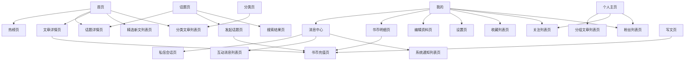

# 线框跳转链路复审

> **序号**：07 · **类型**：review · **创建**：2026-07-07 · **状态**：✅ 已完成  
> **上游** → 全部 `wireframe-*.md`（25 份）+ [`03-track-线框图修订-2026-04-23.md`](03-track-线框图修订-2026-04-23.md)  
> **下游** → [`10-track-需求文档-v1-2026-07-07.md`](10-track-需求文档-v1-2026-07-07.md)、[`08-track-数据表设计-2026-07-07.md`](08-track-数据表设计-2026-07-07.md)、[`09-todo-项目总进度-2026-07-07.md`](09-todo-项目总进度-2026-07-07.md)

---

## 一、线框清单（25 份）

| 分类 | 页面 | 文件 | 状态 |
|---|---|---|---|
| Tab 主流程 | 首页 | `wireframe-首页.md` | ✅ |
| Tab 主流程 | 话题页 | `wireframe-话题页.md` | ✅ |
| Tab 主流程 | 写文页 | `wireframe-写文页.md` | ✅ |
| Tab 主流程 | 分类页 | `wireframe-分类页.md` | ✅ |
| Tab 主流程 | 我的 | `wireframe-我的.md` | ✅ |
| 阅读 | 文章详情页 | `wireframe-文章详情页.md` | ✅ |
| 话题 | 话题详情页 | `wireframe-话题详情页.md` | ✅ |
| 话题 | 发起话题页 | `wireframe-发起话题页.md` | ✅ 新增 |
| 列表 | 分类文章列表页 | `wireframe-分类文章列表页.md` | ✅ |
| 列表 | 热榜页 | `wireframe-热榜页.md` | ✅ |
| 列表 | 精选新文列表页 | `wireframe-精选新文列表页.md` | ✅ 新增 |
| 列表 | 搜索结果页 | `wireframe-搜索结果页.md` | ✅ |
| 列表 | 分组文章列表页 | `wireframe-分组文章列表页.md` | ✅ |
| 列表 | 收藏列表页 | `wireframe-收藏列表页.md` | ✅ |
| 用户 | 个人主页 | `wireframe-个人主页.md` | ✅ |
| 用户 | 关注列表页 | `wireframe-关注列表页.md` | ✅ 新增 |
| 用户 | 粉丝列表页 | `wireframe-粉丝列表页.md` | ✅ 新增 |
| 用户 | 编辑资料页 | `wireframe-编辑资料页.md` | ✅ 新增 |
| 用户 | 设置页 | `wireframe-设置页.md` | ✅ 新增 |
| 消息 | 消息中心 | `wireframe-消息中心.md` | ✅ |
| 消息 | 互动消息列表页 | `wireframe-互动消息列表页.md` | ✅ |
| 消息 | 系统通知列表页 | `wireframe-系统通知列表页.md` | ✅ |
| 消息 | 私信会话页 | `wireframe-私信会话页.md` | ✅ |
| 书币 | 书币明细页 | `wireframe-书币明细页.md` | ✅ 新增 |
| 书币 | 书币充值页 | `wireframe-书币充值页.md` | ✅ 新增 |

---

## 二、核心跳转链路（无死链）

---

## 三、复审结论

### 已通过
- 全部 Tab 页及二级列表页跳转目标均有对应线框文件
- 书币消耗场景（写文突破、差评、举报、发起话题、私信、复审）均已在线框中体现确认/引导流程
- 消息中心三级结构（会话列表 → 互动/系统/私信）链路完整
- 等级徽章展示位置已在「我的」「个人主页」定稿

### 已知遗留（阶段二，不阻塞 MVP）
| 编号 | 说明 | 处理 |
|---|---|---|
| L-1 | 个人主页 P1 仍写「未登录点击关注弹提示」，与 G1「全站需登录」矛盾 | 实现时按 G1 处理；线框保留为历史注记，v1 需求文档以 G1 为准 |
| L-2 | 认证申请页（N4）本阶段不做 | 保持搁置 |
| L-3 | 话题投票（TD1）本阶段不做 | 保持搁置 |
| L-4 | 首页关注动态（H3）本阶段不做 | 保持占位 |
| L-5 | 登录页本身无线框 | MVP 可用微信一键登录弹层，无需独立线框 |
| L-6 | 举报原因选择中间页未单独开线框 | 合并在文章详情状态6弹窗内，实现时补原因列表 UI |

### 复审结论
**线框链路可进入需求文档反推与数据表设计阶段。**

---

## 修订记录

| 日期 | 说明 |
|------|------|
| 2026-07-07 | 首版：25 份线框全量复审，确认无跳转死链 |
