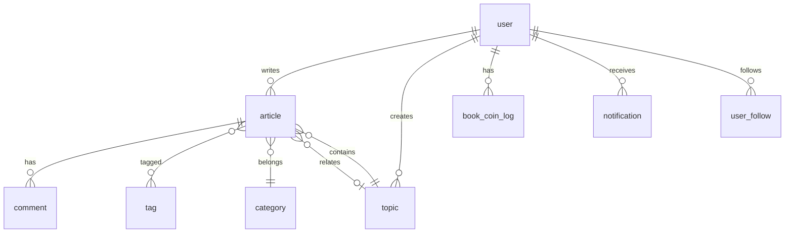

# 数据表设计

> **序号**：08 · **类型**：track · **创建**：2026-07-07 · **最后更新**：2026-07-08 · **状态**：✅ MVP 初稿（已同步 12-track）  
> **上游** → [`10-track-需求文档-v1-2026-07-07.md`](10-track-需求文档-v1-2026-07-07.md)、[`05-track-书币系统-2026-05-05.md`](05-track-书币系统-2026-05-05.md)、[`06-track-等级系统-2026-05-20.md`](06-track-等级系统-2026-05-20.md)、[`12-track-审核模块-2026-07-08.md`](12-track-审核模块-2026-07-08.md)  
> **下游** → T9 Flyway 建表、[`11-track-API设计-2026-07-08.md`](11-track-API设计-2026-07-08.md)、server 实现

---

## 一、设计原则

- 表结构从 v1 需求文档与线框反推，非 v0 草稿
- 书币参数、等级门槛使用 key-value 配置表，避免硬编码
- MVP 优先：先覆盖核心发文/阅读/互动/书币/消息链路
- 字段类型为逻辑类型，具体 DB 选型（MySQL/PostgreSQL）实现时微调
- **等级**：MVP 使用 0-5，表字段与配置表预留扩展更高等级上限的能力，业务规则以 `user_level_config.max_level` 为准

---

## 二、用户域

### `user`

| 字段 | 类型 | 说明 |
|---|---|---|
| id | BIGINT PK | 用户ID |
| internal_uid | CHAR(15) UNIQUE NOT NULL | 系统内部唯一标识，15 位阿拉伯数字；创建时随机生成，不可修改，C 端不可见 |
| openid | VARCHAR NULL | 微信 openid；运营账号可为 NULL |
| login_name | VARCHAR UNIQUE NULL | 后台用户名；C 端 MVP 为 NULL |
| account_name | VARCHAR(15) UNIQUE NULL | C 端用户自定义登录名；`[a-zA-Z0-9_]`，≤15 位；首次设密时设置 |
| account_name_changed_at | DATETIME NULL | 账号上次变更时间；90 天内限改 1 次 |
| password_hash | VARCHAR NULL | bcrypt；管理员必填 |
| phone | VARCHAR UNIQUE NULL | 阶段二绑定 |
| email | VARCHAR UNIQUE NULL | 阶段二绑定 |
| phone_verified | TINYINT DEFAULT 0 | |
| email_verified | TINYINT DEFAULT 0 | |
| nickname | VARCHAR(15) | 昵称 |
| avatar_url | VARCHAR | 头像 |
| bio | VARCHAR(1024) | 个人简介，可空；最长 1024 字符 |
| level | SMALLINT | 当前等级；MVP 取值 0-5，预留扩展（实际上限见 `user_level_config.max_level`） |
| level_score | INT | 当前加权总分（冗余，事件触发重算） |
| book_coin_balance | INT | 书币余额，≥0 |
| article_count | INT | 审核通过文章数（冗余，可算） |
| total_likes_received | INT | 累计获赞（冗余） |
| hotrank_top10_count | INT | 热榜 Top10 次数（冗余） |
| follower_count | INT | 粉丝数（冗余；`user_follow` 中 `user_id=本人` 的行数） |
| following_count | INT | 关注数（冗余；`user_follow` 中 `follower_id=本人` 的行数） |
| role | TINYINT DEFAULT 2 | **值越小权限越高**：`0` 超级管理员 · `1` 管理员 · `2` 普通用户（微信首登默认）。后台准入：`role IN (0,1)`（禁止 `>=` / `<=` 区间比较） |
| status | TINYINT | 0正常 1封禁 |
| created_at | DATETIME | 注册时间 |
| updated_at | DATETIME | |

### `user_follow`

关注关系：一行表示「某粉丝关注了某用户的主页」。

| 字段 | 类型 | 说明 |
|---|---|---|
| id | BIGINT PK | |
| user_id | BIGINT | 主页用户ID（被关注方；其粉丝列表即本表中 `follower_id` 的集合） |
| follower_id | BIGINT | 粉丝用户ID（关注方；在粉丝列表中展示的每一条用户） |
| created_at | DATETIME | 关注时间 |

唯一索引：`(user_id, follower_id)`

> 命名说明：不使用「被关注者 followee」等易产生歧义的文案；`user_id` 指主页主人，`follower_id` 指该主页的一名粉丝。

**计数冗余**：关注/取关时事务内更新双方 `user` 表：`user_id` 对应用户的 `follower_count ±1`，`follower_id` 对应用户的 `following_count ±1`。资料卡数字行直接读冗余字段，避免列表页 `COUNT(*)`。

**规模说明**：1 万粉丝 = 1 万行关系数据，属正常设计；大 V 场景靠分页 + 冗余 count，后续可加缓存。

### `user_level_config`

key-value 配置表，字段见 [`06-track-等级系统-2026-05-20.md`](06-track-等级系统-2026-05-20.md) 第九章。

### `user_level_score_log`

等级加权分流水，用于审计、防刷追溯与删文回滚。

| 字段 | 类型 | 说明 |
|---|---|---|
| id | BIGINT PK | |
| user_id | BIGINT | 得分用户（作者） |
| source_type | VARCHAR | article / like / hotrank / rollback |
| source_id | BIGINT | 关联文章ID、点赞ID或热榜记录ID |
| delta | INT | 分值变动（正=加分，负=扣回） |
| score_after | INT | 变动后 user.level_score |
| cap_applied | TINYINT | 0否 1是（是否触发热榜封顶） |
| remark | VARCHAR | 可读摘要 |
| created_at | DATETIME | |

索引：`(user_id, created_at)`、`(source_type, source_id)`

---

## 三、内容域

### `article`

| 字段 | 类型 | 说明 |
|---|---|---|
| id | BIGINT PK | |
| user_id | BIGINT | 作者 |
| title | VARCHAR(15) | |
| content | TEXT | 正文（含图片块标记或关联） |
| cover_url | VARCHAR | 封面图 |
| category_id | BIGINT | 小类ID，可空 |
| topic_id | BIGINT | 关联话题，可空 |
| word_count | INT | 正文字数 |
| word_limit_purchased | INT | 本篇书币突破购买的额外字数 |
| status | TINYINT | 0草稿 1审核中 2已发布 3已拒绝 4已删除 |
| reject_reason | VARCHAR | 拒绝原因 |
| like_count | INT | 冗余 |
| dislike_count | INT | 冗余 |
| comment_count | INT | 冗余 |
| view_count | INT | 冗余 |
| ai_quality_score | SMALLINT | AI 审核质量分 0–100，可空；精选排序用 |
| published_at | DATETIME | |
| created_at | DATETIME | |
| updated_at | DATETIME | |

### `article_image`

| 字段 | 类型 | 说明 |
|---|---|---|
| id | BIGINT PK | |
| article_id | BIGINT | |
| url | VARCHAR | |
| sort_order | TINYINT | 1-3 |

### `article_tag`

| 字段 | 类型 | 说明 |
|---|---|---|
| article_id | BIGINT | |
| tag_id | BIGINT | |

### `tag`

| 字段 | 类型 | 说明 |
|---|---|---|
| id | BIGINT PK | |
| name | VARCHAR | 唯一 |
| use_count | INT | 冗余 |

### `category`

| 字段 | 类型 | 说明 |
|---|---|---|
| id | BIGINT PK | |
| parent_id | BIGINT | 0=大类 |
| name | VARCHAR | |
| sort_order | INT | |
| is_default | TINYINT | 0否 1是；仅一个小类为默认（综合>生活随笔） |
| is_home_recommended | TINYINT | 0否 1是；**仅大类**可标记；首页模块4固定展示 5 个 `is_home_recommended=1` 的大类 |
| home_sort_order | INT | 首页推荐大类展示顺序，1–5；与 `is_home_recommended` 联用 |

> **首页推荐大类**：管理员在后台勾选 5 个大类并排序；`GET /api/v1/categories/preview` 读 `parent_id=0 AND is_home_recommended=1 ORDER BY home_sort_order`。

### `article_group`

| 字段 | 类型 | 说明 |
|---|---|---|
| id | BIGINT PK | |
| user_id | BIGINT | |
| name | VARCHAR | |
| sort_order | INT | |

### `article_group_item`

| 字段 | 类型 | 说明 |
|---|---|---|
| group_id | BIGINT | |
| article_id | BIGINT | |

---

## 四、话题域

### `topic`

| 字段 | 类型 | 说明 |
|---|---|---|
| id | BIGINT PK | |
| user_id | BIGINT | 发起人 |
| title | VARCHAR(20) | |
| description | VARCHAR(200) | |
| cover_url | VARCHAR | |
| duration_days | INT | 7/14/30 |
| reward_pool_amount | INT | 奖励池书币，0=无 |
| reward_top_n | TINYINT | Top3/Top5 |
| reward_ratio | VARCHAR | 如 "5:3:2" |
| status | TINYINT | 0审核中 1进行中 2已结束 3已拒绝 4已下架 |
| reject_reason | VARCHAR | 审核拒绝原因（冗余，与最新 `content_review.reject_reason` 同步） |
| start_at | DATETIME | |
| end_at | DATETIME | |
| article_count | INT | 冗余 |
| created_at | DATETIME | |

---

## 五、互动域

### `article_like` / `article_dislike` / `article_favorite`

| 字段 | 类型 | 说明 |
|---|---|---|
| id | BIGINT PK | |
| user_id | BIGINT | 点赞用户 |
| article_id | BIGINT | |
| counts_for_level_score | TINYINT | 是否计入作者升级分：0否 1是（按 06-track 防刷规则判定） |
| created_at | DATETIME | |

> 升级分重算：文章审核通过/获赞/热榜结算/删文拒审时异步触发；亦可定时全量校准。

### `comment`

| 字段 | 类型 | 说明 |
|---|---|---|
| id | BIGINT PK | |
| article_id | BIGINT | |
| user_id | BIGINT | |
| parent_id | BIGINT | 0=一级 |
| reply_to_user_id | BIGINT | 楼中楼 |
| content | TEXT | |
| quote_text | VARCHAR(100) | 引用块 |
| like_count | INT | |
| created_at | DATETIME | |

### `report`

| 字段 | 类型 | 说明 |
|---|---|---|
| id | BIGINT PK | |
| reporter_id | BIGINT | |
| target_type | TINYINT | 1文章 2评论 |
| target_id | BIGINT | |
| reason | VARCHAR | 枚举 code：illegal/porn/spam/plagiarism/abuse/misinfo/other |
| reason_detail | VARCHAR | `other` 时必填补充说明（10~200 字） |
| status | TINYINT | 0待处理 1成立 2不成立 |
| created_at | DATETIME | |

---

## 六、书币域

### `book_coin_config`

key-value 配置表，字段见 [`05-track-书币系统-2026-05-05.md`](05-track-书币系统-2026-05-05.md) 第八章。

### `book_coin_log`

| 字段 | 类型 | 说明 |
|---|---|---|
| id | BIGINT PK | |
| user_id | BIGINT | |
| amount | INT | 正=收入 负=支出 |
| balance_after | INT | 变动后余额 |
| type | VARCHAR | 如 publish_reward / dislike / recharge |
| ref_type | VARCHAR | 关联实体类型 |
| ref_id | BIGINT | 关联实体ID |
| remark | VARCHAR | 展示用摘要 |
| created_at | DATETIME | |

### `book_coin_recharge_order`

| 字段 | 类型 | 说明 |
|---|---|---|
| id | BIGINT PK | |
| user_id | BIGINT | |
| amount_fen | INT | 支付金额（分） |
| coin_amount | INT | 到账书币 |
| wx_transaction_id | VARCHAR | 微信支付单号 |
| status | TINYINT | 0待支付 1成功 2失败 |
| created_at | DATETIME | |
| paid_at | DATETIME | |

---

## 七、消息域

### `notification`

| 字段 | 类型 | 说明 |
|---|---|---|
| id | BIGINT PK | |
| user_id | BIGINT | 接收者 |
| type | VARCHAR | like/comment/follow/audit_pass/audit_reject/system/level_up |
| title | VARCHAR | |
| content | TEXT | |
| ref_type | VARCHAR | |
| ref_id | BIGINT | |
| is_read | TINYINT | |
| created_at | DATETIME | |

### `dm_conversation`

| 字段 | 类型 | 说明 |
|---|---|---|
| id | BIGINT PK | |
| user_a_id | BIGINT | 较小ID |
| user_b_id | BIGINT | 较大ID |
| last_message_at | DATETIME | |
| created_at | DATETIME | |

### `dm_message`

| 字段 | 类型 | 说明 |
|---|---|---|
| id | BIGINT PK | |
| conversation_id | BIGINT | |
| sender_id | BIGINT | |
| content_type | TINYINT | 1文字 2图片 |
| content | TEXT | |
| is_read | TINYINT | |
| created_at | DATETIME | |

### `announcement`

系统公告（管理员发布；用户侧经 `notification.type=system` 投递）。

| 字段 | 类型 | 说明 |
|---|---|---|
| id | BIGINT PK | |
| title | VARCHAR(100) | 公告标题 |
| content | TEXT | 正文 |
| publisher_id | BIGINT | 发布管理员 user_id |
| status | TINYINT | 0草稿 1已发布 |
| published_at | DATETIME | 发布时间 |
| created_at | DATETIME | |

> **投递**：发布时为全站用户批量写入 `notification`（`type=system`，`ref_type=announcement`，`ref_id=id`）；MVP 可异步任务生成。

---

## 八、审核域

### `content_review`

| 字段 | 类型 | 说明 |
|---|---|---|
| id | BIGINT PK | |
| content_type | TINYINT | 1文章 2话题 |
| content_id | BIGINT | |
| review_type | TINYINT | 1首次AI 2AI复审 3人工复审 |
| status | TINYINT | 0待处理 1通过 2拒绝 |
| appeal_text | TEXT | 申诉说明 |
| reject_reason | VARCHAR | |
| reviewer_id | BIGINT | 人工审核员 user_id；AI 审核为 null |
| ai_score | SMALLINT | AI 综合分 0–100，可空 |
| ai_dimensions | JSON | AI 分项得分 `{compliance,quality,spam,abuse}`，可空 |
| created_at | DATETIME | |
| completed_at | DATETIME | |

索引：`(content_type, status, created_at)`、`(content_id, content_type)`

---

## 九、热榜与配置

### `ranking_config`

key-value 配置表，字段见 10-track 附录 A。

| Key | 默认值 | 含义 |
|---|---|---|
| `hot_weight_view_ln` | 10 | 阅读对数系数 |
| `hot_weight_like` | 3 | 点赞权重 |
| `hot_weight_comment` | 10 | 评论权重 |
| `hot_weight_dislike` | 2 | 差评扣分 |
| `hot_min_likes` | 1 | 入榜最低赞数（与 view 二选一） |
| `hot_min_views` | 20 | 入榜最低阅读 |
| `featured_days` | 7 | 精选候选天数 |
| `featured_ai_weight` | 0.7 | AI 分权重 |
| `featured_fresh_weight` | 0.3 | 新鲜度权重 |
| `category_hot_days` | 30 | 分类热度时间窗 |
| `default_category_id` | — | 默认小类 ID（综合>生活随笔），与 `category.is_default` 一致 |

### `feature_config`

客户端功能开关与运营配置（key-value）。小程序启动时 `GET /api/v1/config/client` 拉取。

| Key | 默认值 | 含义 |
|---|---|---|
| `recharge_enabled` | `false` | 是否展示充值入口并允许创建充值订单；未获微信支付商户资质前保持 `false` |
| `recharge_custom_amount_enabled` | `false` | 是否展示「自定义金额」档位（依赖 `recharge_enabled`） |

> 书币数值类配置仍在 `book_coin_config`（如 `recharge_ratio`）。

### `hotrank_daily`

| 字段 | 类型 | 说明 |
|---|---|---|
| id | BIGINT PK | |
| rank_date | DATE | |
| article_id | BIGINT | |
| rank | TINYINT | 1-10 |
| hot_score | DECIMAL | |
| reward_coin | INT | 已发放书币 |
| created_at | DATETIME | |

> **阶段二（互动窗）**：可选 `article_stats_hourly` 按小时汇总阅读/赞/评/差评增量，供 `window_mode=engagement` 列表复用 `hot_score` 公式；MVP 不建。

---

## 十、表关系概览

---

## 十一、Flyway 落地顺序（T9）

> 脚本路径：`server/src/main/resources/db/migration/`。已提交脚本禁止修改，改表新建下一版本。

### P0 — 发文审核闭环（优先）

| 顺序 | 表 | 说明 |
|:---:|---|---|
| 1 | `user` | 含 `role` |
| 2 | `tag`、`category` | 含 `is_home_recommended`；种子见 [`15-track-分类种子数据`](15-track-分类种子数据-2026-07-08.md) |
| 3 | `article`、`article_image`、`article_tag` | 内容主表 |
| 4 | `content_review` | 含 `ai_score`、`ai_dimensions` |
| 5 | `notification` | 审核结果通知 |
| 6 | `book_coin_config`、`book_coin_log` | 复审扣费、发文奖励 |
| 7 | `announcement` | 可选与 P0 同期或 P1 |

### P1 — 首页与话题

| 顺序 | 表 |
|:---:|---|
| 1 | `topic` |
| 2 | `ranking_config`、`hotrank_daily` |
| 3 | `article_like` / `dislike` / `favorite`、`comment` |
| 4 | `report` |

### P2 — 社交与私信

| 顺序 | 表 |
|:---:|---|
| 1 | `user_follow`、`user_level_config`、`user_level_score_log` |
| 2 | `dm_conversation`、`dm_message` |
| 3 | `article_group`、`article_group_item` |
| 4 | `book_coin_recharge_order` |

---

## 修订记录

| 日期 | 说明 |
|------|------|
| 2026-07-07 | MVP 初稿：覆盖用户/内容/话题/互动/书币/消息/审核/热榜 |
| 2026-07-07 | 同步加权分升级：`user.level_score`、`user_level_score_log`、`article_like.counts_for_level_score` |
| 2026-07-07 | `bio` 扩至 1024 字符；`level` 改 SMALLINT 并预留扩展；`user_follow` 字段改为 `user_id`+`follower_id`（粉丝/主页用户） |
| 2026-07-07 | `user` 表新增 `follower_count`、`following_count` 冗余及维护说明 |
| 2026-07-08 | 新增 `ranking_config`；`article.ai_quality_score`；`category.is_default`；`report.reason_detail`；附录 A/B 对齐 |
| 2026-07-08 | 同步 12-track：`user.role`、`content_review.ai_score/ai_dimensions`、`category` 首页推荐字段、`topic.reject_reason`、`announcement` 表；增第十一节 Flyway 分批 |
| 2026-07-10 | V10：`user` 扩展登录字段；`role` 取值修订（0 超管 / 1 管理员 / 2 用户）；新增 `report`、`feature_config`；鉴权改显式 `IN` / 枚举方法 |
| 2026-07-10 | V13：`internal_uid`、`account_name`、`account_name_changed_at`；双字段语义分离（内部标识 vs 用户登录名） |
