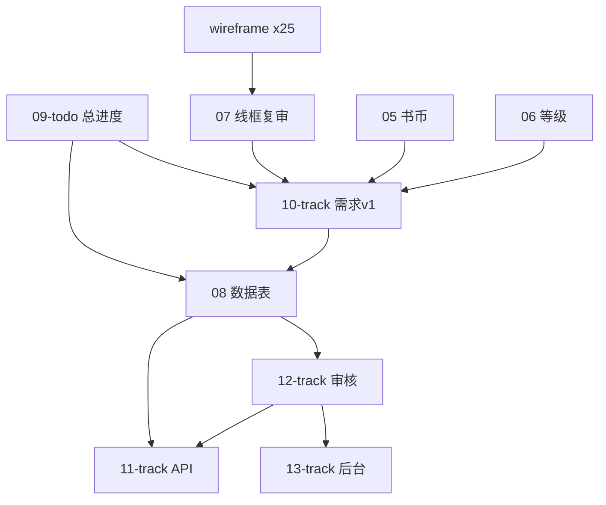

# 项目总进度（入口文档）

> **序号**：09 · **类型**：todo · **创建**：2026-07-07 · **最后更新**：2026-07-10 · **状态**：🔄 进行中（P1 T10/T11/T13 已落地，OpenAPI 客户端全量迁移完成，T12 二级页面待做）  
> **说明**：**打开 ice 仓库，产品文档入口见 `docs/09-todo`（本文）**。汇总阶段、待办、下一步与文档地图。子文档细节见各 track/review。  
> **维护约定**：本文是唯一总入口；新增专题时**只更新本文地图与待办**，不新建第二个 09。详见 [`../.cursor/rules/wireframe-convention.mdc`](../.cursor/rules/wireframe-convention.mdc)「锚点 vs 分支」。  
> **下游** → T9 Flyway 建表 · server 审核闭环

---

## 零、本次继续做什么（速览）

> 每次打开项目：**先看本节 → 第四节待办 → 第五节建议下一步**。做完一条就在第四节打 `[x]`。

| 优先级 | 行动 |
|:---:|---|
| **现在** | P2 二级页面完整实现（T12：热榜/话题详情/发起话题/搜索等） |
| **接着** | P2 互动（赞评藏）· 书币充值 |

**锚点文档（长期改原文件）**：`09-todo`（本文）· `10-track`（需求 v1）· `08-track`（数据表）

---

## 一、当前阶段

```
✅ 线框图（25 份）  →  ✅ 书币/等级规则  →  ✅ 需求 v1 + 数据表
         →  ✅ T1 API + T2 审核 + ai 骨架  →  ✅ T9 建表 + 后端审核闭环联调
         →  ✅ P0 真机/开发者工具联调 + 生产 WX_*/JWT_* 配置 + 发文保存测试通过
         →  ✅ P1 首页/话题完整页 + C 端多方式登录（阶段二）
         →  ✅ 账号体系 V13（internal_uid + account_name）+ 设置页改造
```

**阶段定位**：P1 首页信息流、话题广场、手机号/密码登录、设置页已落地；下一步推进 T12 二级页面与 P2 互动。

---

## 二、文档地图

### 锚点与分支

| 文件 | 角色 | 你会怎么做 |
|---|---|---|
| **09-todo（本文）** | 总入口 | 只更新这一份；新专题建成后补链接、勾待办 |
| **10-track** | 需求 v1 准绳 | 小改原文；v2 大改再新建文件 |
| **08-track** | 数据表 | 原地更新；Flyway 分批见第八节第十一节 |
| **11、12、13…** | 专题 | 新建文件，**不覆盖** 09/10 |

---

| 顺序 | 文件 | 用途 |
|:---:|---|---|
| **0** | **本文 `09-todo`** | 总进度、待办、下一步（**唯一入口**） |
| 1 | [`10-track-需求文档-v1-2026-07-07.md`](10-track-需求文档-v1-2026-07-07.md) | 产品需求准绳（总览） |
| 2 | `wireframe-*.md`（25 份） | 页面结构与交互 |
| 3 | [`08-track-数据表设计-2026-07-07.md`](08-track-数据表设计-2026-07-07.md) | 数据库表结构 + Flyway 分批 |
| 4 | [`11-track-API设计-2026-07-08.md`](11-track-API设计-2026-07-08.md) | 对外 REST + P0 契约附录 |
| 5 | [`12-track-审核模块-2026-07-08.md`](12-track-审核模块-2026-07-08.md) | AI 审核、复审、人工队列 |
| 6 | [`13-track-管理后台MVP-2026-07-08.md`](13-track-管理后台MVP-2026-07-08.md) | 后台页面与权限 |
| 7 | [`14-track-微信登录流程-2026-07-08.md`](14-track-微信登录流程-2026-07-08.md) | 登录与 JWT |
| 8 | [`15-track-分类种子数据-2026-07-08.md`](15-track-分类种子数据-2026-07-08.md) | T7 首批分类 |
| 9 | [`16-track-首页话题P1实施方案-2026-07-10.md`](16-track-首页话题P1实施方案-2026-07-10.md) | T10 首页/话题 P1 实施 |
| 10 | [`17-track-C端多方式登录方案-2026-07-10.md`](17-track-C端多方式登录方案-2026-07-10.md) | T11 登录阶段二 |
| — | [`arch-tech-stack.md`](arch-tech-stack.md) | 三端技术架构 |

### 专题规则（深挖时打开）

| 文件 | 内容 |
|---|---|
| [`05-track-书币系统-2026-05-05.md`](05-track-书币系统-2026-05-05.md) | 书币获取/消耗完整规则 |
| [`06-track-等级系统-2026-05-20.md`](06-track-等级系统-2026-05-20.md) | 等级、加权分、防刷 |
| [`04-review-消息私信积分系统设计-2026-05-03.md`](04-review-消息私信积分系统设计-2026-05-03.md) | 消息/私信/书币边界 |

### 过程文档（历史/存档）

| 序号 | 文件 | 状态 | 备注 |
|:---:|---|:---:|---|
| 01 | [`01-todo-线框图初稿-2026-04-21.md`](01-todo-线框图初稿-2026-04-21.md) | 已归档 | |
| 02 | [`02-review-线框图评审基线-2026-04-23.md`](02-review-线框图评审基线-2026-04-23.md) | 已定稿 | 历史基线 |
| 03 | [`03-track-线框图修订-2026-04-23.md`](03-track-线框图修订-2026-04-23.md) | 已归档 | |
| 07 | [`07-review-线框跳转链路复审-2026-07-07.md`](07-review-线框跳转链路复审-2026-07-07.md) | 已完成 | |
| 11 | [`11-todo-需求文档迁入ice-2026-07-08.md`](11-todo-需求文档迁入ice-2026-07-08.md) | 已归档 | 序号 11 的 `todo`=迁入清单；`track`=API 设计 |

### 规范与历史

| 文件 | 用途 |
|---|---|
| [`.cursor/rules/product-design.mdc`](../.cursor/rules/product-design.mdc) | 工作流、术语、Tab、工程边界 |
| [`.cursor/rules/wireframe-convention.mdc`](../.cursor/rules/wireframe-convention.mdc) | 线框与 0X 命名规范 |
| [`.cursor/rules/requirement-document.mdc`](../.cursor/rules/requirement-document.mdc) | 需求文档定位 |
| [`_archived-需求文档-v0-总体设计.md`](_archived-需求文档-v0-总体设计.md) | 早期草稿，勿作准绳 |

### 线框清单（25 份）

Tab 主流程：`wireframe-首页` · `wireframe-话题页` · `wireframe-写文页` · `wireframe-分类页` · `wireframe-我的`  
阅读/列表：`wireframe-文章详情页` · `wireframe-热榜页` · `wireframe-精选新文列表页` · `wireframe-搜索结果页` · `wireframe-分类文章列表页`  
话题：`wireframe-话题详情页` · `wireframe-发起话题页`  
用户：`wireframe-个人主页` · `wireframe-编辑资料页` · `wireframe-设置页` · `wireframe-关注列表页` · `wireframe-粉丝列表页` · `wireframe-分组文章列表页` · `wireframe-收藏列表页`  
消息：`wireframe-消息中心` · `wireframe-互动消息列表页` · `wireframe-系统通知列表页` · `wireframe-私信会话页`  
书币：`wireframe-书币明细页` · `wireframe-书币充值页`

---

## 三、已完成清单

- [x] 11 页初稿线框 + 14 页补线框（共 25 份）
- [x] 线框修订任务（03-track 全部条目）
- [x] 书币系统规则（05-track）
- [x] 等级系统 + 加权分升级（06-track）
- [x] 消息/私信/书币边界（04-review）
- [x] 线框跳转全量复审（07-review）
- [x] 需求文档 v1 反推（10-track）
- [x] 数据表 MVP 初稿（08-track，含 `follower_count` / `following_count`）
- [x] 文档命名统一（需求 v1 纳入 10-track）
- [x] 热榜/精选公式与举报枚举、默认分类（T4/T5 → 10-track 附录 A/B）
- [x] 产品文档复制迁入 `ice/docs/`；Cursor rules 合并至仓库根
- [x] 技术选型与 ice 脚手架对齐（T8；见 `docs/arch-tech-stack.md`）
- [x] T1 API 接口清单（`11-track-API设计`）
- [x] T2 审核模块最小方案（`12-track-审核模块`）
- [x] `ai/` FastAPI 骨架（health + `/internal/audit` mock）
- [x] 08-track 同步 12-track（`user.role`、`content_review` 增补、首页推荐大类、`announcement`）
- [x] T3/T6/T7 专题文档（`13-track` / `14-track` / `15-track`）
- [x] 线框待定项收口（话题/搜索/首页模块1/私信）
- [x] 11-track P0 接口契约附录
- [x] T9 Flyway P0 建表（`user` / `category` / `article` / `content_review` / `notification` / `book_coin_*` / `announcement`）
- [x] server 审核闭环：发布 → 调 `ai/internal/audit` → 写 `article` / `content_review` → 写系统通知
- [x] server ↔ `ai/` 联调：通过链路、拒绝链路、待人工链路已验证
- [x] P0 小程序：Tab 骨架 + 写文/我的/详情/系统通知 + Vant Weapp + OpenAPI 生成客户端（`api/instances.ts`）
- [x] T3 管理后台 Web：`admin/` Vue3 + Element Plus；OpenAPI 生成客户端（`admin/src/api/instances.ts`）
- [x] V10 迁移：`user` 登录字段、`report`、`feature_config`、种子超管；`UserRole`/`UserLevel` 枚举
- [x] P0 真机/开发者工具联调：冷启动登录 → 写文发布 → 我的筛选 → 通知 → 后台审核链路通过
- [x] 生产环境配置 `WX_APP_ID` / `WX_APP_SECRET` / `JWT_SECRET` / `JWT_EXPIRE_DAYS`
- [x] 发文章保存（草稿/发布）测试通过
- [x] T10 首页/话题 P1：V11 建表、聚合接口、小程序首页/话题页按线框落地
- [x] T11 登录阶段二：短信验证码、密码登录、getUserProfile 同步、设置页、账号注销
- [x] T13 账号体系：V13 `internal_uid`/`account_name`、设密双确认、改账号 90 天限次、设置页 UI 修复

---

## 四、待办（开发前建议完成）

### P0 — 不开这些很难完整落地

| ID | 任务 | 建议产出 | 状态 |
|:---:|---|---|:---:|
| T1 | API 接口清单 | `11-track-API设计-YYYY-MM-DD.md` | [x] |
| T2 | 审核模块最小方案 | `12-track-审核模块-YYYY-MM-DD.md` | [x] |
| T3 | 管理后台 MVP 范围 | `13-track-管理后台MVP-YYYY-MM-DD.md` | [x] |
| T4 | 热榜 / 精选新文默认公式 | 写入 10-track 附录 A + 08-track `ranking_config` | [x] |
| T5 | 举报原因枚举 + 默认分类名 | 写入 10-track 附录 B + product-design | [x] |

### P1 — 可与开发并行

| ID | 任务 | 状态 |
|:---:|---|:---:|
| T6 | 微信登录最短流程说明 | [x] |
| T7 | 首批分类种子数据 | [x] |
| T8 | 技术选型（小程序框架、后端、DB、OSS） | [x] |
| T9 | 工程脚手架 + 建表 | [x]（脚手架已有；Flyway P0 建表、server 审核闭环、server↔`ai/` 联调已完成） |
| T10 | 首页/话题完整页实施 | [x] |
| T11 | C 端多方式登录（阶段二） | [x] |

### P2 — 阶段二（明确不做）

话题投票、关注动态、BGM、搜索历史、访客列表付费、未登录只读浏览等 → 见 [10-track 第 7 章](10-track-需求文档-v1-2026-07-07.md)

### P1 后续（二级页面完整实现）

| ID | 任务 | 状态 |
|:---:|---|:---:|
| T12 | 热榜完整页 / 精选新文列表页 / 话题详情页 / 发起话题页 / 搜索结果页 | [ ] |

---

## 五、建议下一步（本周）

1. **T12 二级页面**：热榜完整页、话题详情、发起话题、搜索结果完整实现
2. **P2 互动**：赞评藏接口与详情页接入
3. **书币充值**：资质就绪后启用 `recharge_enabled`

---

## 六、文档关系图



---

## 修订记录

| 日期 | 说明 |
|------|------|
| 2026-07-07 | 首版：项目总入口、文档地图、待办与命名统一说明 |
| 2026-07-07 | 增「零、本次继续做什么」与锚点/分支说明；规范写入 wireframe-convention |
| 2026-07-08 | T4/T5 完成：热榜/精选公式、举报枚举、默认分类写入 10-track 附录 |
| 2026-07-08 | 产品文档复制迁入 ice 仓库 `docs/`；唯一编辑入口为 ice/docs |
| 2026-07-08 | T2/T1 完成：`12-track-审核模块`、`11-track-API设计`；`ai/` FastAPI 骨架落地 |
| 2026-07-08 | 文档缺口审查：08-track 同步、T3/T6/T7 专题、09-todo 刷新、线框待定收口 |
| 2026-07-08 | T9 完成：Flyway P0 建表、server 审核闭环、server↔`ai/` 联调通过/拒绝/待人工链路已验证 |
| 2026-07-09 | 高考作文（命题专区/题面）暂缓，不做分类扩展；分类维持 [`15-track`](15-track-分类种子数据-2026-07-08.md) 现稿（两级 + 扁平小类）。日后另建 `NN-track`，勿往通用 `category` 塞年份-卷别 |
| 2026-07-10 | P0 小程序与管理后台 Web（T3）实施完成；账号体系 + `role` 取值修订（值越小权限越高）同步 08/11-track |
| 2026-07-10 | P0 真机联调/生产环境变量/发文保存测试通过；新增 T10/T11 待办；新建 16-track、17-track 专题 |
| 2026-07-10 | OpenAPI 客户端全量迁移：小程序/admin 删除手写 `client.ts`/`p0`/`p1`，统一 `api/instances.ts` + `generate:api` 双端生成 |
| 2026-07-10 | T10/T11 实施完成：V11/V12 建表、首页/话题/登录阶段二后端+小程序；openapi 重新生成 |
| 2026-07-10 | T13 账号体系与设置页：V13 迁移、`internal_uid`/`account_name` 双字段、密码双确认、改账号限次 |
| 2026-07-10 | V14 迁移：统一 JDBC/Flyway UTF-8、修复话题/分类中文乱码、补充 12 篇演示文章种子（首页热榜/精选/分类预览可展示） |
