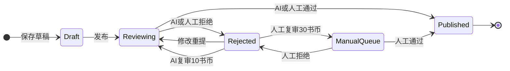

# 审核模块最小方案

> **序号**：12 · **类型**：track · **创建**：2026-07-08 · **状态**：已定稿（MVP）  
> **上游** → [`10-track-需求文档-v1-2026-07-07.md`](10-track-需求文档-v1-2026-07-07.md) 第 8 章 · [`08-track-数据表设计-2026-07-07.md`](08-track-数据表设计-2026-07-07.md) 审核域 · [`05-track-书币系统-2026-05-05.md`](05-track-书币系统-2026-05-05.md) 第六章  
> **下游** → [`11-track-API设计-2026-07-08.md`](11-track-API设计-2026-07-08.md) · `ai/` FastAPI 服务 · T9 Flyway 建表

---

## 一、模块定位

| 项 | 说明 |
|---|---|
| 审核对象 | **文章**（首发 / 修改重提 / AI 复审）、**话题**（高等级用户发起） |
| 调用边界 | 小程序只调 `server/`（Kotlin Spring Boot）；**AI 服务为内网微服务**，不进入小程序 OpenAPI 生成链路 |
| MVP 范围 | AI 过/不过 + 书币复审 + 人工队列 + 极简管理后台 |
| 不做 | 申请人工审核入口（写文页 W3 已定不做）、BGM、复杂多级审批 |

---

## 二、审核对象与触发时机

### 2.1 文章

| 触发场景 | 前置状态 | 审核类型 `review_type` | 说明 |
|---|---|:---:|---|
| 用户点击「发布」 | 草稿 → 审核中 | 1 首次 AI | 写文页提交；同步调用 AI |
| 审核拒绝后修改重提 | 已拒绝 → 审核中 | 1 首次 AI | 视为新一轮首次 AI，不扣书币 |
| 系统通知内「AI 复审」 | 已拒绝 | 2 AI 复审 | 扣 10 书币 + 必填申诉说明 |
| 系统通知内「人工复审」 | 已拒绝 | 3 人工复审 | 扣 30 书币 + 必填申诉说明；进人工队列 |

### 2.2 话题

| 触发场景 | 前置状态 | 审核类型 | 说明 |
|---|---|:---:|---|
| 发起话题页提交 | — → 审核中 | 1 首次 AI | 扣 20 书币 + 奖励池锁定；同步调用 AI |
| 审核失败 | 审核中 → 已拒绝 | — | **退还**发起费 + 奖励池 |
| 审核通过 | 审核中 → 进行中 | — | 不退费；按 `duration_days` 计算 `start_at` / `end_at` |

话题 MVP **不支持**书币复审；拒绝后仅展示原因，用户可修改后重新发起（重新扣费）。

---

## 三、AI 评分维度与阈值

### 3.1 模型选型与 Provider 可插拔

AI 服务（`ai/` Python FastAPI）封装大模型；`server/` 不直连大模型。通过 **Provider Registry** 切换后端，环境变量 `AI_PROVIDER` 指定激活项。

| Provider code | 服务 | MVP 状态 |
|:---:|---|---|
| `mock` | 规则 Mock | **默认** |
| `deepseek` | DeepSeek API | 预留，实现留空 |
| `doubao` | 豆包 / 火山方舟 | 预留，实现留空 |
| `glm` | 智谱 GLM | 预留，实现留空 |
| `langchain` | LangChain 编排层（可路由至上述模型） | 预留，实现留空 |

- 首选生产：**DeepSeek**（成本低）
- 降级顺序建议：`deepseek` → `doubao` → `glm`（由 `ai/` 配置，非 `server` 业务逻辑）
- 契约不变：无论底层 Provider，`POST /internal/audit` 请求/响应格式一致（见附录 A）

### 3.2 评分维度（0–100 综合分）

AI 返回 `overall_score`（综合分）及分项 `dimensions`，写入审核记录供人工参考：

| 维度 code | 含义 | 权重建议 |
|---|---|---|
| `compliance` | 合规性（涉政、暴恐、色情、违法） | 一票否决项，< 40 直接拒绝 |
| `quality` | 内容质量（原创性、可读性、信息量） | 40% |
| `spam` | 广告引流、灌水重复 | 30% |
| `abuse` | 人身攻击、辱骂 | 30% |

**综合分计算**（AI 服务内部）：

```
overall_score = quality × 0.4 + (100 - spam) × 0.3 + (100 - abuse) × 0.3
若 compliance < 40 → overall_score = min(overall_score, 39)  // 强制低于通过线
```

### 3.3 通过阈值

| 分数区间 | 结果 | 后续 |
|---|---|---|
| `overall_score ≥ 60` | **通过** | 文章→已发布；话题→进行中；写入 `ai_quality_score` |
| `40 ≤ overall_score < 60` | **拒绝（可申诉）** | 进人工队列备选；用户可修改重提或书币复审 |
| `overall_score < 40` | **拒绝（严重违规）** | 同上；`reject_reason` 附具体维度说明 |

阈值 60 与 [`arch-tech-stack.md`](arch-tech-stack.md) 第五节一致；后续可通过 `ranking_config` 或环境变量调整，MVP 硬编码 60。

### 3.4 `ai_quality_score` 产出

- 审核**通过**时：取 `overall_score` 写入 `article.ai_quality_score`（0–100）
- 用于精选新文 `featured_score` 计算（见 10-track 附录 A）
- 审核拒绝：不写入；复审通过后补写

---

## 四、状态机

### 4.1 文章状态 `article.status`

```
0 草稿 ──发布──→ 1 审核中 ──AI/人工通过──→ 2 已发布
                    │                        │
                    │ AI/人工拒绝             │ 用户删文
                    ↓                        ↓
                 3 已拒绝 ──修改重提──→ 1 审核中    4 已删除
```

| status | 值 | 用户可见 | 说明 |
|---|:---:|---|---|
| 草稿 | 0 | 仅作者 | 可继续编辑 |
| 审核中 | 1 | 仅作者 | 发布/重提/复审处理中 |
| 已发布 | 2 | 公开 | `published_at` 写入审核通过时刻 |
| 已拒绝 | 3 | 仅作者 | 附 `reject_reason`；可重提或复审 |
| 已删除 | 4 | — | 软删除 |

### 4.2 话题状态 `topic.status`

```
──提交──→ 0 审核中 ──通过──→ 1 进行中 ──到期──→ 2 已结束
              │                    │
              │ 拒绝               │ 管理员下架
              ↓                    ↓
           3 已拒绝              4 已下架
```

### 4.3 审核记录 `content_review`

每触发一次审核动作插入一条记录（与 08-track 对齐）：

| 字段 | 说明 |
|---|---|
| `content_type` | 1 文章 · 2 话题 |
| `content_id` | 关联 ID |
| `review_type` | 1 首次 AI · 2 AI 复审 · 3 人工复审 |
| `status` | 0 待处理 · 1 通过 · 2 拒绝 |
| `appeal_text` | 复审申诉说明（`review_type` ≥ 2 时必填） |
| `reject_reason` | 拒绝原因文案（展示给用户） |
| `reviewer_id` | 人工审核员 user_id；AI 审核为 null |
| `ai_score` | AI 综合分，可空（人工审核无分） |
| `ai_dimensions` | JSON，分项得分，可空 |
| `created_at` / `completed_at` | 创建 / 完成时间 |

> **08-track 增补**：`content_review` 表增加 `ai_score SMALLINT`、`ai_dimensions JSON` 字段（T9 Flyway 落地时一并添加）。

### 4.4 状态流转（Mermaid）



---

## 五、同步调用与超时降级

MVP **同步审核**：发布/复审接口内调用 AI 服务，等待结果后写库并返回。

| 项 | 值 |
|---|---|
| AI 服务超时 | **15 秒** |
| 超时 / AI 服务不可用 | 文章/话题保持「审核中」；`content_review.status=0`（待处理）；**自动进入人工队列** |
| 用户感知 | 发布成功提示「已提交审核，请稍候」；轮询或推送通知告知最终结果 |
| 人工 SLA | AI 复审排队 48h 内；人工复审 72h 内（05-track） |

> 首版不引入消息队列；文章量大后再评估异步 + Worker。

---

## 六、用户侧流程

### 6.1 文章审核通过

1. `article.status` → 2；`published_at` = now
2. 写入 `ai_quality_score`
3. 系统通知：「文章审核通过」→ 跳转文章详情页
4. 触发等级加权分重算、发文书币奖励（+5/篇，日限 3，05-track）

### 6.2 文章审核拒绝

1. `article.status` → 3；`reject_reason` 写入
2. 系统通知：「文章审核未通过」+ 原因 + 操作按钮
   - 「修改文章后重新提交」→ 写文页（带原文）
   - 「AI 复审 10 书币」「人工复审 30 书币」→ 申诉弹窗
3. 书币不足时复审按钮禁用 → 书币充值页

### 6.3 复审规则（对齐 05-track 第六章）

| 类型 | 书币 | SLA | 说明 |
|---|---|---|---|
| AI 复审 | 10 | 48h | 重新走 AI；结果同首次 |
| 人工复审 | 30 | 72h | 进人工优先队列；展示 `appeal_text` |
| 修改重提 | 0 | 同步 AI | 不扣书币 |

- 复审费**不退**（无论通过与否）
- **无次数限制**；每次复审新建 `content_review` 记录

### 6.4 话题审核

- **通过**：`status` → 1；`start_at` = now；`end_at` = now + duration；系统通知
- **拒绝**：`status` → 3；退还发起费 20 + 奖励池；系统通知（无跳转，仅原因）

---

## 七、极简管理后台 MVP

> 合入 T3 管理后台范围；审核模块本期最小集如下。

### 7.1 人工审核队列

| 项 | 说明 |
|---|---|
| 入口 | 管理员 Web 后台（`/admin/reviews`） |
| 列表筛选 | `status=0`（待处理）；可按 `content_type`、`review_type`、时间排序 |
| 优先展示 | `review_type=3`（人工复审）> AI 超时降级 > `review_type=2` |
| 详情 | 正文/标题/标签/封面；AI 分项得分；用户申诉说明 |
| 操作 | **通过** / **拒绝**（必选拒绝原因） |

### 7.2 人工拒绝原因枚举

| code | 展示文案 |
|---|---|
| `illegal` | 含有违法违规内容 |
| `porn` | 含有色情低俗内容 |
| `spam` | 含有垃圾广告或引流信息 |
| `low_quality` | 内容质量不达标 |
| `off_topic` | 与话题/分类严重不符 |
| `other` | 其他（必填补充说明） |

与举报枚举（10-track 附录 B）部分复用，后台可统一组件。

### 7.3 权限

- 仅 `role=admin` 用户可访问人工队列
- 操作写 `reviewer_id` + `completed_at`；记操作日志（阶段二）

---

## 八、系统通知类型

| type | 触发 | 跳转 |
|---|---|---|
| `audit_pass` | 文章/话题审核通过 | 详情页 |
| `audit_reject` | 文章审核拒绝 | 写文页 / 复审按钮 |
| `topic_audit_reject` | 话题审核拒绝 | 无 |

消息表 `notification.type` 已有 `audit_pass` / `audit_reject`（08-track），话题拒绝复用 `audit_reject` 并带 `content_type` 区分。

---

## 附录 A：server → ai 内部 API 草案

> 供 T1 API 设计与 `ai/` 骨架实现直接引用。仅 `server/` 内网调用，不对小程序暴露。

### A.1 通用约定

| 项 | 值 |
|---|---|
| Base URL | `http://ai:8000`（Docker）/ `http://localhost:8000`（本地） |
| 认证 | Header `X-Internal-Token: {INTERNAL_API_TOKEN}`（环境变量，两端一致） |
| Content-Type | `application/json` |
| 超时 | server 侧 15s |

### A.2 `GET /health`

健康检查，Docker / 负载均衡探活。

**响应 200**

```json
{ "status": "ok" }
```

### A.3 `POST /internal/audit`

统一审核入口；`content_type` 区分文章/话题，AI 服务内部分派 Prompt。

**请求体**

```json
{
  "request_id": "uuid",
  "content_type": "article",
  "review_type": "initial",
  "title": "菜市场的清晨",
  "body": "正文纯文本或 Markdown...",
  "tags": ["生活", "随笔"],
  "topic_title": "春日手账",
  "appeal_text": null
}
```

| 字段 | 类型 | 必填 | 说明 |
|---|---|:---:|---|
| `request_id` | string | 是 | 幂等键，建议 `content_review.id` |
| `content_type` | enum | 是 | `article` · `topic` |
| `review_type` | enum | 是 | `initial` · `ai_appeal`（对应 DB 1/2；人工复审不走 AI） |
| `title` | string | 是 | 标题 |
| `body` | string | 是 | 正文；话题时为 `description` |
| `tags` | string[] | 否 | 文章标签名列表 |
| `topic_title` | string | 否 | 文章关联话题标题 |
| `appeal_text` | string | 否 | AI 复审申诉说明 |

**响应 200**

```json
{
  "request_id": "uuid",
  "result": "pass",
  "overall_score": 78,
  "dimensions": {
    "compliance": 95,
    "quality": 72,
    "spam": 10,
    "abuse": 5
  },
  "reject_reason": null,
  "model": "deepseek-chat",
  "latency_ms": 1200
}
```

| 字段 | 说明 |
|---|---|
| `result` | `pass` · `reject` · `manual`（不确定，建议人工） |
| `overall_score` | 0–100 |
| `dimensions` | 分项得分 |
| `reject_reason` | `result=reject` 时用户可见文案 |
| `model` | 实际使用的模型标识 |
| `latency_ms` | 调用耗时 |

**错误响应**

| HTTP | 说明 | server 处理 |
|:---:|---|---|
| 408 / 504 | 超时 | 保持审核中，进人工队列 |
| 5xx | AI 服务故障 | 同上 |
| 401 | Token 无效 | 告警，进人工队列 |

### A.4 MVP Mock 行为（骨架阶段）

未配置 `DEEPSEEK_API_KEY` 时：

- 正文含 `__reject__` → `result=reject`, `overall_score=30`
- 正文含 `__manual__` → `result=manual`, `overall_score=55`
- 默认 → `result=pass`, `overall_score=75`

便于 server 联调，不依赖外网大模型。

---

## 修订记录

| 日期 | 说明 |
|------|------|
| 2026-07-08 | MVP 首版：状态机、阈值、复审、人工后台、内部 API 草案 |
