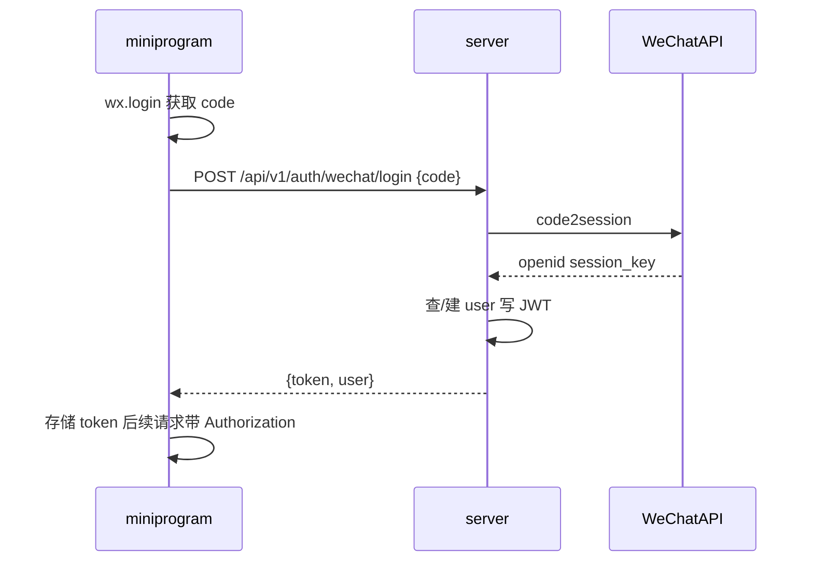

# 微信登录最短流程

> **序号**：14 · **类型**：track · **创建**：2026-07-08 · **状态**：已定稿（MVP）  
> **上游** → [`10-track-需求文档-v1-2026-07-07.md`](10-track-需求文档-v1-2026-07-07.md) §3 G1 · [`08-track-数据表设计-2026-07-07.md`](08-track-数据表设计-2026-07-07.md) `user` 表  
> **下游** → [`11-track-API设计-2026-07-08.md`](11-track-API设计-2026-07-08.md) · `miniprogram/` · `server/` 鉴权

---

## 一、流程概览



---

## 二、接口契约

### `POST /api/v1/auth/wechat/login`

**请求**

```json
{ "code": "wx_login_code_from_client" }
```

**响应 200**

```json
{
  "token": "eyJhbG...",
  "expires_in": 604800,
  "user": {
    "id": 10001,
    "nickname": "微信用户",
    "avatar_url": "https://...",
    "level": "reader",
    "level_name": "读者",
    "book_coin_balance": 0,
    "role": "user"
  }
}
```

**错误**

| code | 说明 |
|---|---|
| `WX_LOGIN_FAILED` | code 无效或已过期 |
| `USER_BANNED` | `user.status=1` |

---

## 三、服务端逻辑

1. 用 `code` 调微信 `auth.code2Session`，得 `openid`（及 `session_key`，MVP 可不持久化）
2. `SELECT * FROM user WHERE openid=?`
3. **不存在**：`INSERT` 新用户
   - `nickname`：默认「微信用户」+ 随机后缀，或调微信用户信息（需用户授权 `getUserProfile`，阶段二）
   - `avatar_url`：默认头像
   - `level`：`reader`（code 0）；`role`：`user`（code 2）
4. **存在**：校验 `status`；封禁则拒绝
5. 签发 JWT：`sub=user.id`，`exp=7d`（可配置）
6. 返回 token + 用户摘要

---

## 四、小程序侧

1. `app.ts` `onLaunch`：若无本地 token 或已过期 → 调登录
2. `wx.login` → 拿 `code` → `POST /auth/wechat/login`
3. `wx.setStorageSync('token', token)`
4. 封装 API 客户端：每个请求 Header `Authorization: Bearer ${token}`
5. **401**：清 token，重新登录

> MVP **全站需登录**（10-track G1）：未登录可进首页只读（阶段二）；当前实现为启动即登录。

---

## 五、配置项

| 环境变量 | 说明 |
|---|---|
| `WX_APP_ID` | 小程序 AppID |
| `WX_APP_SECRET` | 小程序 AppSecret |
| `JWT_SECRET` | JWT 签名密钥 |
| `JWT_EXPIRE_DAYS` | 默认 7 |

---

## 修订记录

| 日期 | 说明 |
|------|------|
| 2026-07-08 | MVP 首版：code2session + JWT + 首登建 user |
| 2026-07-10 | `user` 响应改 slug 字符串；首登 `role=2`（`user`）；本地开发可用 `dev:openid` 作为 code |
